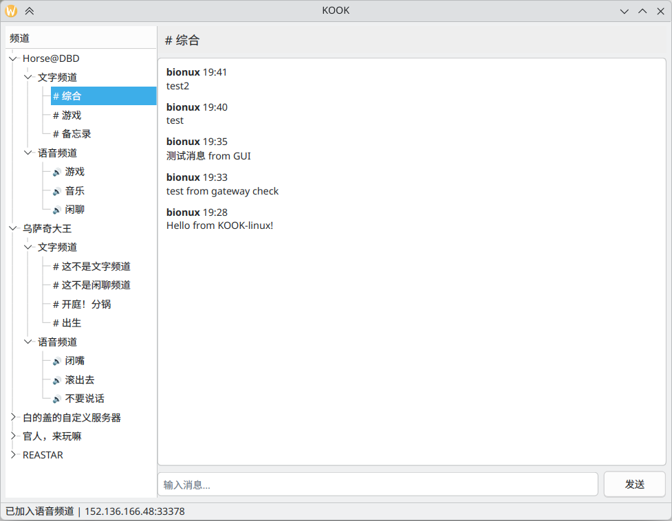

# KOOK Linux

KOOK（原开黑啦）第三方 Linux 桌面客户端，支持文字聊天、语音通话和图形界面。



## 功能

- **登录** — 手机号/密码登录 或 Token 登录，自动保存会话
- **文字频道** — 消息历史加载、实时消息推送（WebSocket）、图片显示
- **语音频道** — WebRTC 语音通话、麦克风输入、音频文件推流
- **图形界面** — PyQt6 界面，服务器/频道树，自动托盘驻留
- **命令行** — `login`、`guilds`、`channels`、`join` 等子命令

## 安装

```bash
git clone https://github.com/bionux-th/KOOK-Linux.git
cd KOOK-Linux
python3 -m venv .venv
source .venv/bin/activate
pip install -r requirements.txt
```

需要系统包：`ffmpeg`、`python3-pip`（Arch: `sudo pacman -S ffmpeg python-pip`）

## 使用

### 图形界面

```bash
python3 main.py --gui
```

首次启动弹出登录界面，支持手机号+密码或 Token 登录。登录成功后进入主界面，左侧显示服务器列表，点击展开频道，选择文字频道聊天或语音频道通话。

### 命令行

```bash
# 登录
python3 main.py login --phone 138xxxx --password yourpass

# 列出服务器
python3 main.py guilds

# 列出频道
python3 main.py channels --guild <guild_id> --type 2

# 加入语音频道
python3 main.py join --channel <channel_id>

# 列出频道内用户
python3 main.py users --channel <channel_id>
```

## 项目结构

| 文件 | 说明 |
|------|------|
| `kook_auth.py` | 登录认证、会话管理 |
| `kook_api.py` | KOOK v3 HTTP API 封装 |
| `kook_voice.py` | WebRTC 语音客户端（aiortc + mediasoup） |
| `kook_chat.py` | WebSocket 实时消息网关 |
| `kook_gui.py` | PyQt6 图形界面 |
| `main.py` | CLI 入口 |
| `KOOK.png` | 应用图标 |

## 技术栈

- **Python 3.14**
- **PyQt6** — 图形界面
- **aiortc + av** — WebRTC 语音（mediaSoup 信令）
- **websocket-client** — 实时消息网关
- **requests** — HTTP API
- **ffmpeg** — 音频采集/播放

## 协议

MIT
